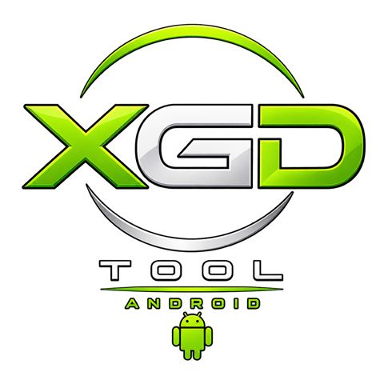
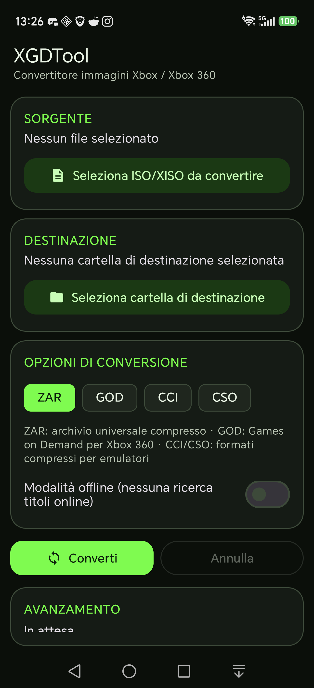

# ⚠️ REPOSITORY DEPRECATED & MOVED / PROGETTO SPOSTATO

> ### 🛑 English: This standalone repository is ARCHIVED
> **All development on this standalone repository has ceased. The Android port has been fully merged into the main unified repository:**
> 
> 👉 **[https://github.com/Ashnar2602/XGDTool](https://github.com/Ashnar2602/XGDTool)**
> 
> **Why switch to the main repository?**
> * ⚡ **Zero-Copy Storage Engine**: Convert directly in place without wasting 15–20 GB of device cache.
> * 🚀 **Unified Cross-Platform**: Native Android app (Material 3 Dark) + Windows GUI & CLI in a single cohesive project.
> * 🛠️ **Latest Fixes & Enhancements**: Includes the critical ZAR-to-image fix, fast streaming checksums, and lock-free parallel compression.
> * 📦 **Download Latest APK (v1.3.1+)**: [Ashnar2602/XGDTool Releases](https://github.com/Ashnar2602/XGDTool/releases)

---

> ### 🛑 Italiano: Questo repository è ARCHIVIATO
> **Lo sviluppo di questo repository standalone è terminato. L'applicazione Android è stata interamente unificata nel repository principale:**
> 
> 👉 **[https://github.com/Ashnar2602/XGDTool](https://github.com/Ashnar2602/XGDTool)**
> 
> **Novità e vantaggi del repository principale:**
> * ⚡ **Motore Zero-Copy**: Conversione diretta su disco senza consumare 15–20 GB di cache temporanea.
> * 🚀 **Progetto Unico e Completo**: App Android nativa (Material 3 Neon Dark) + versioni Windows GUI e CLI.
> * 🛠️ **Correzioni e Ottimizzazioni**: Fix critico per ZAR ➔ ISO, streaming checksum a costo zero e multithreading avanzato.
> * 📦 **Download dell'APK aggiornato (v1.3.1+)**: [Ashnar2602/XGDTool Releases](https://github.com/Ashnar2602/XGDTool/releases)

---

  

  <a href="README.md">🇬🇧 English</a> ·
  <a href="README.it.md">🇮🇹 Italiano</a> ·
  <a href="README.fr.md">🇫🇷 Français</a> ·
  <a href="README.de.md">🇩🇪 Deutsch</a> ·
  <a href="README.es.md">🇪🇸 Español</a> ·
  <a href="README.pt.md">🇵🇹 Português</a> ·
  <a href="README.zh-CN.md">🇨🇳 简体中文</a>

# XGDTool for Android (Archived)

Unofficial port of [XGDTool](https://github.com/wiredopposite/XGDTool)
(GPL-3.0) to Android: converts Xbox / Xbox 360 disc images (ISO, stripped
XISO) to **ZAR**, **GOD**, **CCI**, **CSO**, and **XISO** directly from your phone,
so you can back up your physical game collection without a PC.

  

## Features

- Convert between XISO, ZAR, GOD, CCI, CSO — the same C++ engine used by
  the desktop version of XGDTool.
- **Batch conversion**: select multiple files at once, they're processed
  in a queue automatically.
- Optional automatic online title lookup, to rename the output with a
  readable game title.
- No invasive storage permissions: everything goes through Android's
  Storage Access Framework — you choose which folders the app can see.
- Interface in 7 languages (auto-detected from the phone's system
  language): Italian, English, French, German, Spanish, Portuguese,
  Simplified Chinese.
- Runs as a foreground service: you can leave the app during a long
  conversion without interrupting it.

## Where to get current versions

**Please do not download old APKs from this archived repository.**
Download the latest versions from:
👉 **[https://github.com/Ashnar2602/XGDTool/releases](https://github.com/Ashnar2602/XGDTool/releases)**
